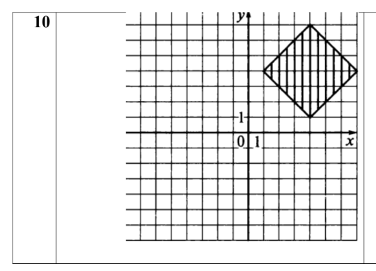
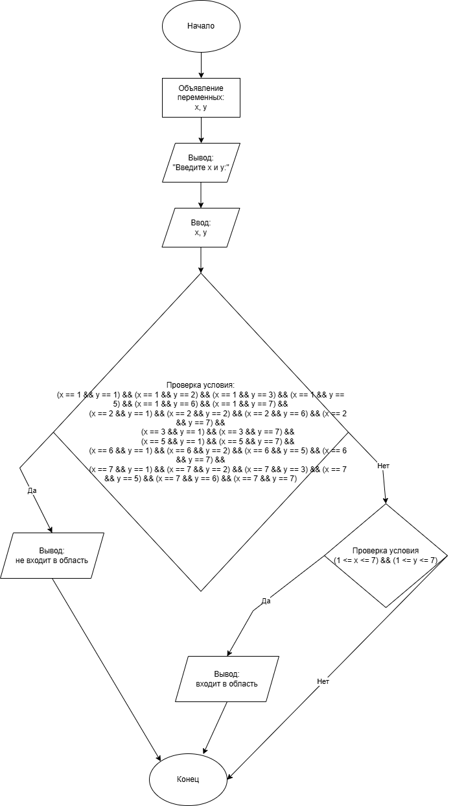
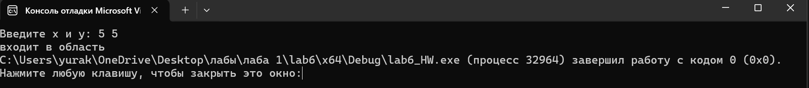

# Домашняя работа к лабораторной работе 6.
## Условия задачи:
Составить программу, которая проверяет принадлежит ли заданная пользователем точка с
координатами (х, у) заданным закрашенным (заштрихованным) областям, показанным на рисунках
в табл., и выводит на экран сообщение.


## 1. Алгоритм и блок схема:
### Алгоритм:
1. **Начало**
2. Объявить переменные:
 	- `x` — входное число
	- `y` — входное число
3. Ввод переменных:
   - Ввод переменной: `x`
   - Ввод переменной: `y`
4. Проверка условия:

   ((x == 1 && y == 1) && (x == 1 && y == 2) && (x == 1 && y == 3) && (x == 1 && y == 5) && (x == 1 && y == 6) && (x == 1 && y == 7) &&
		(x == 2 && y == 1) && (x == 2 && y == 2) && (x == 2 && y == 6) && (x == 2 && y == 7) &&
		(x == 3 && y == 1) && (x == 3 && y == 7) &&
		(x == 5 && y == 1) && (x == 5 && y == 7) &&
		(x == 6 && y == 1) && (x == 6 && y == 2) && (x == 6 && y == 5) && (x == 6 && y == 7) &&
		(x == 7 && y == 1) && (x == 7 && y == 2) && (x == 7 && y == 3) && (x == 7 && y == 5) && (x == 7 && y == 6) && (x == 7 && y == 7))
6. Вывести результаты расчётов с подстановкой значений в текст.
7. **Конец**

### Блок схема

## 2. Реализация программы:
```
#include <locale.h>
#include <stdio.h>

int main() {

	setlocale(LC_ALL, "");

	float x, y;

	printf("Введите x и y: ");
	scanf("%f %f", &x, &y);
	
	if ((x == 1 && y == 1) && (x == 1 && y == 2) && (x == 1 && y == 3) && (x == 1 && y == 5) && (x == 1 && y == 6) && (x == 1 && y == 7) &&
		(x == 2 && y == 1) && (x == 2 && y == 2) && (x == 2 && y == 6) && (x == 2 && y == 7) &&
		(x == 3 && y == 1) && (x == 3 && y == 7) &&
		(x == 5 && y == 1) && (x == 5 && y == 7) &&
		(x == 6 && y == 1) && (x == 6 && y == 2) && (x == 6 && y == 5) && (x == 6 && y == 7) &&
		(x == 7 && y == 1) && (x == 7 && y == 2) && (x == 7 && y == 3) && (x == 7 && y == 5) && (x == 7 && y == 6) && (x == 7 && y == 7))
		printf("не входит в область");
	else if ((1 <= x <= 7) && (1 <= y <= 7)) printf("входит в область");
}
```
## 3. Результат работы программы

## 4. Информация о разработчике
Капичников Юрий, бИПТ-252
